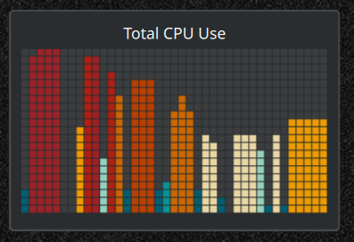

# Wildfire

A **System Monitor Sensor face for KDE Plasma 6** that shows sensor history as a
scrolling, pixel-art bar chart. Each sample becomes a vertical bar of stacked
square "pixels"; the bar's height is the current value and its colour runs from
cold (idle) to hot (busy). New samples enter on the right and scroll left.

Great for CPU usage — low load stays cold and blue-green, spikes burn amber and
red like a wildfire.



## Features

- Scrolling history bar chart with a retro pixel/LED-matrix look.
- Cold → hot colour palette mapped to the sensor value.
- Efficient: the chart only repaints when a new sample arrives (~once per
  second), and it pauses while the widget is hidden.
- Optional current-value readout.

## Installation

First clone the repository:

```bash
git clone https://github.com/xr09/Wildfire.git
cd Wildfire
```

Then install it with **either** method below.

### kpackagetool (recommended)

```bash
kpackagetool6 --type KSysguard/SensorFace --install .
# to update after pulling changes:
kpackagetool6 --type KSysguard/SensorFace --upgrade .
```

### Manual (symlink)

Symlink the checkout into your local sensor-faces directory as `Wildfire`
(handy for development — `git pull` then reload):

```bash
mkdir -p ~/.local/share/ksysguard/sensorfaces
ln -s "$PWD" ~/.local/share/ksysguard/sensorfaces/Wildfire
```

After either method, restart plasmashell so it picks up the face:

```bash
kquitapp6 plasmashell; kstart plasmashell
```

## Usage

1. Add a **System Monitor Sensor** widget to a panel or the desktop.
2. Configure it → **Appearance / Display Style** → choose **Wildfire**.


## Credits

Built on the KSysguard SensorFace scaffolding from
[OmniGauges](https://github.com/xkain/OmniGauges) by xkain, which in turn builds
on the Plasma system-monitor faces by Marco Martin, David Edmundson and
Arjen Hiemstra.

## License

LGPL-2.1-or-later — see [LICENSE](LICENSE).
